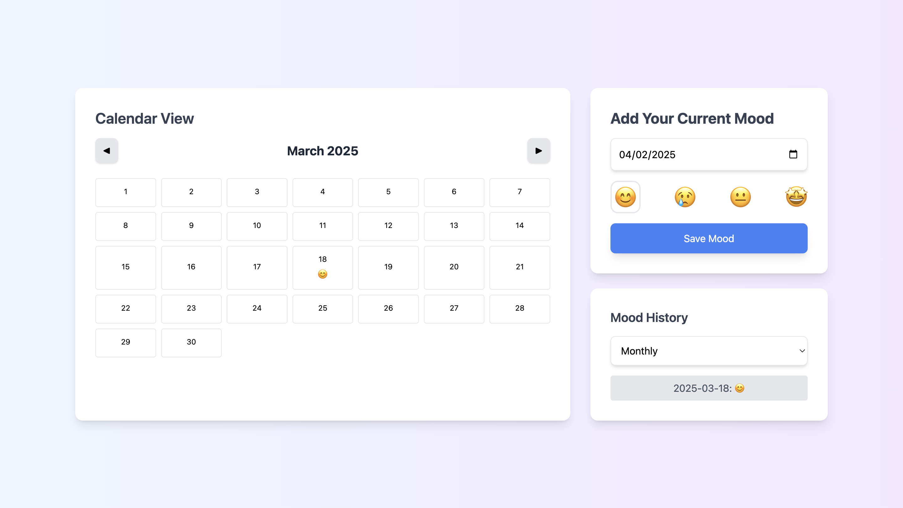

# Mood Tracker

## 🌟 Overview
Mood Tracker is a simple web application that allows users to log their daily moods using emoji-based selections. The app stores mood entries in LocalStorage and provides a timeline view to visualize emotional trends over time.

## 🚀 Live Demo
🔗 [Track Mood App](https://track-mood.vercel.app/)

## ✨ Features
- Pick a mood emoji (happy, sad, neutral, excited, etc.) for the day
- Store mood logs in LocalStorage for persistence
- View past moods with day/week/month-wise filtering
- Responsive design for mobile and desktop users
- Calendar view to track mood trends over time

## 📸 Screenshots



## 🛠️ Technologies Used
- **Frontend:** HTML, Tailwind CSS, JavaScript
- **Storage:** LocalStorage
- **Deployment:** Vercel

## 🔧 Setup & Installation
1. Clone the repository:
   ```sh
   git clone https://github.com/yourusername/daily-mood-tracker.git
   ```
2. Navigate to the project folder:
   ```sh
   cd daily-mood-tracker
   ```
3. Open `index.html` in your browser or use a local development server.

## 🚀 Deployment
- The app is deployed on Vercel: [Live Demo](https://track-mood.vercel.app/)
- To deploy manually, use any static site hosting service like Netlify, GitHub Pages, or Vercel.


---
Happy tracking! 😊

